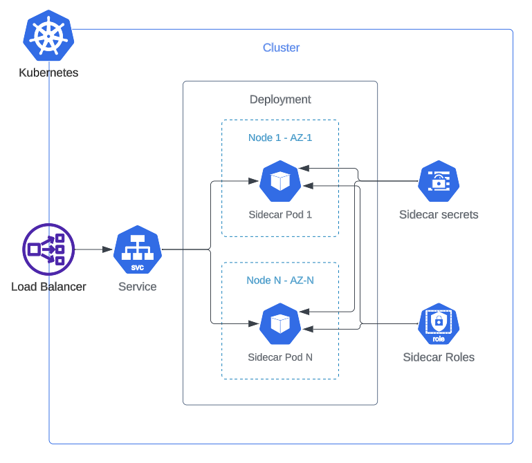

# Sidecar - Helm

A quick start to deploy a sidecar to Kubernetes using Helm!

---

## Architecture



---

## Deployment

### Requirements

* A running [Kubernetes](https://kubernetes.io/) cluster.
* Install [Helm](https://helm.sh/docs/intro/install/).
* Install [Kubectl](https://kubernetes.io/docs/tasks/tools/#kubectl).

### Examples

#### Quick Start

* Save the code below in a `values.yaml` file.
    * Fill the parameters `controlPlane.host`, `sidecarId`, `forwardProxy.clientId`, 
    and `forwardProxy.clientSecret` with the information from the `Cyral Templates` option
    in the `Deployment` tab of your sidecar details.

```yaml
controlPlane:
  host: ""

sidecarId: ""

forwardProxy:
  clientId: ""
  clientSecret: ""
​
service:
  enabled: true
  type: LoadBalancer
  annotations:
    ####################### AWS Load Balancer #######################
    service.beta.kubernetes.io/aws-load-balancer-type: "nlb"
    # For a public-facing load balancer, change the value to
    # "internet-facing":
    service.beta.kubernetes.io/aws-load-balancer-scheme: "internal"
    #################################################################
​
    ###################### GCP Load Balancer ########################
    ## In order to use a GCP load balancer instead, comment the
    ## AWS Load Balancer properties above and uncomment the line
    ## below. For a public-facing load balancer, change the value
    ## to "External":
    #cloud.google.com/load-balancer-type: "Internal"
    #################################################################
​
    ###################### Azure Load Balancer ######################
    ## In order to use a Azure load balancer instead, comment the
    ## AWS Load Balancer properties above and uncomment the line
    ## below. For a public-facing load balancer, change the value
    ## to "false":
    #service.beta.kubernetes.io/azure-load-balancer-internal: "true"
    #################################################################
```

* Open a command line terminal in the same folder you saved the file.
* Run the following command to deploy your sidecar, replacing the following variables:
    * `<SIDECAR_NAMESPACE>`: your choice of namespace to be created. We recommend `cyral-` + 
    `<SIDECAR_ID>` to help you locate your namespace on a busy cluster.
    * `<SIDECAR_RELEASE_NAME>`: the name of your release. We also recommend `cyral-` + `<SIDECAR_ID>` or some suffix to help locating the release.
    * `<VERSION>`: the version of your sidecar.

```bash
helm repo add cyral https://charts.cyral.com
helm upgrade -i <SIDECAR_RELEASE_NAME> cyral/cyral-sidecar \
  --namespace <SIDECAR_NAMESPACE> -f values.yaml \
  --create-namespace \
  --version <VERSION>
```

The quick start example above will create the simplest configuration possible on your Kubernetes cluster
and deploy a single sidecar instance behind the load balancer.

Make sure to allow for proper network connectivity from your cluster nodes 
to the databases that will be protected by your sidecar. The nodes must
be able to connect to the databases using the ports that you defined
as part of the [repository configuration](https://cyral.com/docs/manage-repositories/repo-track).

#### Production Starting Point


* Save the code below in a `values.yaml` file.
    * Fill the parameters `controlPlane.host`, `sidecarId`, `forwardProxy.clientId`, 
    and `forwardProxy.clientSecret` with the information from the `Cyral Templates` option
    in the `Deployment` tab of your sidecar details.

```yaml
controlPlane:
  host: ""

sidecarId: ""

forwardProxy:
  clientId: ""
  clientSecret: ""

# Sets the node and inter-pod affinities so pods won't run
# in the same node.
podAntiAffinityPreset: hard

# Number of pods
replicaCount: 2
​
service:
  # Ports that will be exposed by the sidecar to accept 
  # incoming connections.
  ports: [443, 3306, 5432, 27017, 27018, 27019]

  enabled: true
  type: LoadBalancer
  annotations:
    ####################### AWS Load Balancer #######################
    service.beta.kubernetes.io/aws-load-balancer-type: "nlb"
    # For a public-facing load balancer, change the value to
    # "internet-facing":
    service.beta.kubernetes.io/aws-load-balancer-scheme: "internal"
    #################################################################
​
    ###################### GCP Load Balancer ########################
    ## In order to use a GCP load balancer instead, comment the
    ## AWS Load Balancer properties above and uncomment the line
    ## below. For a public-facing load balancer, change the value
    ## to "External":
    #cloud.google.com/load-balancer-type: "Internal"
    #################################################################
​
    ###################### Azure Load Balancer ######################
    ## In order to use a Azure load balancer instead, comment the
    ## AWS Load Balancer properties above and uncomment the line
    ## below. For a public-facing load balancer, change the value
    ## to "false":
    #service.beta.kubernetes.io/azure-load-balancer-internal: "true"
    #################################################################
```

* Open a command line terminal in the same folder you saved the file.
* Run the following command to deploy your sidecar, replacing the following variables:
    * `<RELEASE_NAME>`: your choice of name for the deployment, if its a  single sidecar in a namespace we'll typically use `cyral-sidecar` or `cyral-sidecar-<SIDECAR_ID>`
    * `<SIDECAR_NAMESPACE>`: your choice of namespace to be created. We recommend `cyral-` + 
    `<SIDECAR_ID>` to help you locate your namespace on a busy cluster.
    * `<VERSION>`: the version of your sidecar.

```bash
helm repo add cyral https://charts.cyral.com
helm upgrade -i <RELEASE_NAME> cyral/cyral-sidecar /
  --namespace <SIDECAR_NAMESPACE> -f values.yaml /
  --version <VERSION> --create-namespace
```

The example above will create a production-grade configuration and assumes you understand
the basic concepts of a Cyral sidecar.

For a production configuration, we recommend that you define anti-affinity rules
to prevent two sidecar pods from running in the same node. We also recommend that
the nodes runs on different availability zones and that you properly assess the 
dimensions and number of pods required for your production workload.

Make sure to allow for proper network connectivity from your cluster nodes 
to the databases that will be protected by your sidecar. The nodes must
be able to connect to the databases using the ports that you defined
as part of the [repository configuration](https://cyral.com/docs/manage-repositories/repo-track).

See the next section for more details about the values file parameters.

### Parameters

See the full list of parameters in the [values file configuration reference](./docs/values-file.md).

---

## Upgrade

Use the following procedure to upgrade your sidecar:

* Open a command line terminal in the same folder you have your `values.yaml` file.
* Run the following command to deploy your sidecar, replacing the following variables:
    * `<SIDECAR_NAMESPACE>`: the sidecar namespace.
    * `<VERSION>`: the version the sidecar should be upgraded to.

```bash
helm upgrade -i <SIDECAR_NAMESPACE> cyral-sidecar /
  --namespace <SIDECAR_NAMESPACE> -f values.yaml /
  --repo https://charts.cyral.com /
  --version <VERSION>
```

Learn more in the [sidecar upgrade procedures](https://cyral.com/docs/sidecars/manage/upgrade/) page.

---

## Advanced

Instructions for advanced configurations are available for the following topics:

* [Expose to the Internet](./docs/public-load-balancer.md)
* [Node scheduling](./docs/node-scheduling.md)
* [Restrict repositories' ports](./docs/port-configuration.md)
* [Set up database accounts through environment variables](./docs/database-accounts/environment-variables.md)
* [Set up database accounts through AWS Secrets Manager](./docs/database-accounts/aws-secrets-manager.md)
* [Set up resources](./docs/resources.md)
* [Sidecar certificates](./docs/certificates.md)
* [Sidecar instance metrics](./docs/metrics.md)
* [Use a pre-existing service account](./docs/pre-existing-sa.md)
* [Values file reference](./docs/values-file.md)
